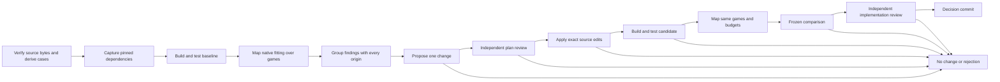

# The improvement pipeline as a CAOS program

The factory submits one bounded program to CAOS. Its workers acquire a frozen
source workload, build the target, discover problems, propose and review a
change, compile it, evaluate it on the same games, and decide what to retain.
The host prepares the input snapshot and displays the result. It does not
schedule the improvement steps.

Each arrow is a data dependency or a native CAOS continuation. The controller
uses `run-request-then` and bounded `map-then`; it exits when it asks for child
work, releasing its worker slot. No worker blocks while waiting for a child.

The [first measured execution](../replays/caos-factory-20260920/README.md) runs
all 20 retained games and ends with a real contributor abstention. A separate,
clearly labeled comment-only integration candidate exercises the entire branch
through compilation, fitting, comparison and final review, and is rejected.
Both baseline and candidate pass the 11 native fitting tests; 11 factory boundary
tests also pass.

## What a result contains

The terminal value is a Git commit whose tree contains a decision receipt and
real links to the evidence that produced it. These include the original source
bytes, derived cases, target source, dependency closure, compiler/test logs,
native observations, discovered issues, model requests and responses, candidate
edits, comparisons, and reviews, when those stages were reached.

An issue records every originating game and observation object. A proposal must
cite existing issue IDs. A candidate links its exact base, edits and proposal.
Review requests include the specific objects being reviewed. The final decision
links both the numerical comparison and independent review. This attribution
is generated as the program runs.

The public replay is a projection of those objects, generated by
[`export.py`](../caos-factory/export.py). It omits private card exports,
binaries, source snapshots, prompts and credentials, retaining their object
identities. Its graph follows receipt links and matches leaf input objects to
their producers. The viewer can inspect the native reconstructed game states.
The older FactoryReplay viewer and historical runs remain available; this pilot
uses a separate `coworld/caos-replay@1` format.

## Frozen policy and typed boundaries

[`contracts.py`](../caos-factory/lib/contracts.py) validates budgets, proposal
components, reviews and exact edits. Unknown fields and malformed model outputs
fail closed. Strict JSON contracts fit naturally inside CAOS Git values here;
there is no additional Protobuf service or separately authored workflow DAG. [The policy](../caos-factory/policy.json) freezes the allowed files,
test commands, search bounds, cohort requirements and acceptance threshold.

One unresolved candidate execution blocks promotion even if the baseline also
timed out. This conservative whole-cohort rule currently blocks otherwise local
repairs until the three unresolved games are addressed. It is a declared policy
choice, not evidence that every useful improvement must fix every game.

A disappearing diagnostic, changed label or faster wall-clock duration does
not count as improvement. The comparison rejects missing games, removed source
fields, changed enforced interpretations, lost coverage, regressed witnesses,
and unresolved candidate executions. It requires a measured improvement and
both model reviews before accepting a candidate. Candidate code cannot edit
the policy or the comparison implementation.

The first repair scope is the Coworld fitter and its Phase reconstruction
bridge. Phase itself stays pinned. A reconstruction or search improvement is
labeled as such; it does not earn engine-correctness credit.

**These are regression and review gates, not a formal proof system.** The native
fitter produces the witnesses being compared; a separately compiled, immutable
witness verifier is not implemented by this migration. Model review is fallible.
An accepted candidate means it satisfied this declared policy on this workload.

## What runs first

The workload is the retained first 20 SOS games in
[`fixtures/17lands/sos-cohort-20`](../fixtures/17lands/sos-cohort-20), with
the official card mapping and pinned full runtime card export. Acquisition
rehashes the retained bytes; it does not pretend to perform a new HTTP download.
The games have been inspected before and are not an unseen holdout.

The original CSV and row index reach the native fitter unchanged. This matters:
the fitter currently uses the row index as its seed. Splitting each game into
row zero would change the experiment. Accordingly, fitting leaves depend on
the frozen cohort CSV as well as an individual case. A future native per-case
input API can make that dependency finer.

Search has a node cap, action cap, turn horizon, memory limit and external
deadline. Unsupported input, unsupported projection, missing witness and budget
exhaustion retain their distinct meanings. They are discoveries, not proofs
that Phase is wrong.

## Cache and failure semantics

Leaf requests receive only their Python module closure and required objects.
They do not receive the entire experiment history. Changing a proposal prompt
can therefore reuse the earlier build and native fitting results. Reusing a
cached result is not a fresh experiment.

The model sample token is explicit. Change it for a new draw; keep it to resume
the same request. Native fits are cached by their inputs and limits, including
a deadline outcome. For an independent native repetition, change an explicit
input such as a repetition token in the policy; do not count a cache hit.

Expected fit failures are normal typed values. A failed build returns its log
and stops the candidate. Single child infrastructure failures are caught and
produce an inconclusive decision. An unexpected failure inside a fitting map
can leave the epoch unfinished; resubmit its recorded request to resume cached
work. CAOS status is operational information. The linked decision commit is the
durable evidence artifact.

One epoch allows one candidate attempt. With a six-call policy budget, a
rejected or schema-invalid plan receives one revision attempt using the exact
review or validation error as feedback;
otherwise it stops. There are at most six model calls. The planner and reviewer
see the actual frozen evaluator source and compact native trajectory examples. It never publishes a target change to GitHub.
The roles are separate calls to the configured contributor, not a claim of
statistical independence between models. The current planner cannot launch
additional diagnosis experiments: expanding that capability, with a budget and
linked evidence, is a useful next step.
An operator can use an accepted source snapshot as the input to the next epoch.

## Running it

Use a CAOS server and client built from the same pinned revision. The first
deployment uses `bbb31008efc443dce779d1ac5b23401dba266203`. The Python package
uses the standard library. The worker image contains the pinned Rust toolchain
and worker-side CAOS executable.

1. Build [the worker image](../caos-factory/runtime/Dockerfile), supplying
   `runtime/caos` from that CAOS build. Import the image with
   `caos-cli import-image` in a private Git client and make it available to the
   server. Retain its Git image ID. Never store credentials in the image.
2. Prepare inputs with `prepare.py --repo <checkout> --corpus <private-corpus-dir>
   --output <new-input-dir>`. The corpus directory contains `card-data.json`
   and `original-manifest.json`.
3. Submit with `submit.py --client <new-private-client-dir> --inputs <input-dir>
   --caos-cli <binary> --server <url> --image <git-image-id>
   --key-file <existing-Anthropic-key-file>`.
   The client is private: it tracks the source workload and corpus locally,
   grants the key only to the frozen model-call expression, and records the
   request, final commit, and CAOS status.
   Alternatively, pass `--contributor <prepared-model-call-capability-id>`
   instead of `--key-file`. The contributor is an ordinary immutable CAOS value.
   `--sample <identity>` explicitly requests a different model draw; omit it to
   keep the prepared input's sample identity.
4. Read the final commit's `tree` line, then run
   `export.py --store <server-git-directory> --root <tree-id> --output <replay-dir>`.
   Serve the generated directory with an ordinary static web server. Copy the
   client's `status.json` into it for the viewer's CAOS execution-tree link.

Do not publish the private client or server store. The export is the sharing
boundary. The model worker records provider/model identity, usage and raw
responses. No provider key is a CAOS object or replay field. A private client may contain
source game data in Git objects even after files are removed; keep that entire
repository private.

Run the small factory boundary suite with
`python3 -B -m unittest discover -s caos-factory/tests -v`.
The native source builds and fitting regression tests execute inside CAOS.

## Generalization

The controller in [`factory.py`](../caos-factory/lib/factory.py), edit/review
contracts, linked receipts and replay projection are independent of Magic.
[`mtg.py`](../caos-factory/lib/mtg.py) supplies source verification, case
derivation, native execution and issue grouping. [`build.py`](../caos-factory/lib/build.py)
is the Rust target adapter.

For a different factory, replace those adapters and the meaning of improvement
in the frozen evaluator. Keep the distinction between proposing a change and
deciding whether its evidence is sufficient. This is a working special case
with explicit seams, not a completed general-purpose factory SDK.
