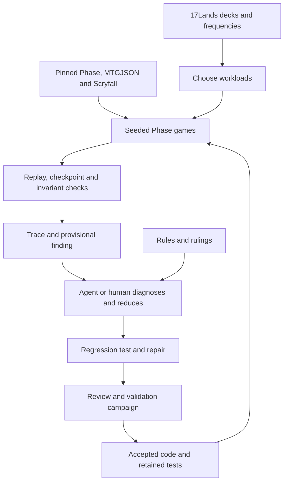
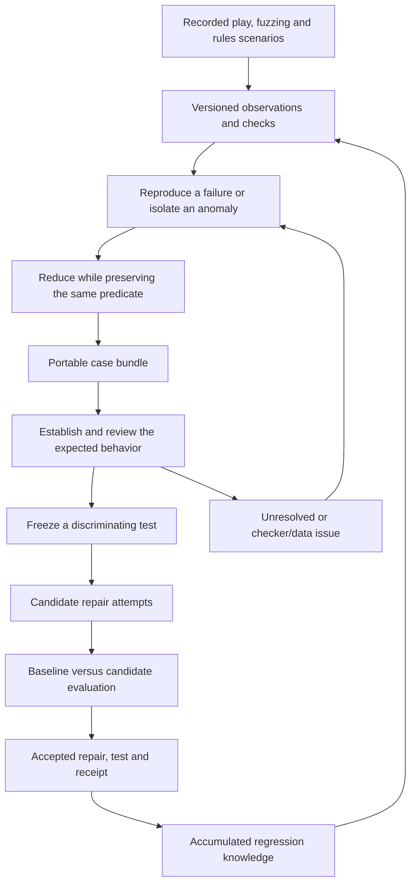

# From debugging campaigns to accumulating executable knowledge

Implementation update: the rules-case, reduction and acceptance path now lives
in [the verifiable case guide](verifiable-cases.md), with generated schemas and
diagrams. The account of `main` below describes the inspected starting commit
`cd4720d26b951b050aba327182e595d811e9acb2`, before these changes.

Design notes, 2026-09-04. Based on the pasted voice conversation, the Codex task
“Draft verifiable AI software blog,” current source, the semantic-generators
branch, and saved campaign artifacts. This is an inspection and proposal; no
new campaign or engine validation was run.

The useful next step is to make the conversion from evidence to a checked
repair a durable part of the repository. The system should retain both the
implementation improvement and the executable reason for accepting it. A
later agent should be able to use that reason without reconstructing the
conversation that produced it.

## What exists

There are three distinct states to keep separate:

| Surface | What it contains | Limit |
| --- | --- | --- |
| Current `main`, `cd4720d26` | Pinned corpus materialization; card metadata checks; seeded legal-action exploration; events, hashes and checkpoints; replay; invariants; finding aggregation; prefix reduction | Repair, semantic test authoring, review, and promotion are coordinated outside the CLI |
| Local `harness-semantic-generators`, `0f4b234ae` | Guided 17Lands fitting, distribution comparisons, ruling candidates, additional ingestion and checking work | Not merged into current `main`; requires review and reconciliation with the current release |
| August campaign artifacts in `tmp/improvement-loop/` | Concrete experiments, repair prompts, run results, and a campaign journal | Historical evidence, sometimes against staged Phase changes; not a certificate for today's pinned binary |

On current `main`, `improve` validates the requested set and Phase revision and
then calls `run_shard`. It does not itself implement a repair-and-accept cycle.
See [the command dispatch](../crates/coworld-mtg-harness/src/main.rs).

The current operational loop is:

The upper half is reusable machinery. Much of the lower half is a workflow
described in [the harness plan](agent-improvement-harness.md) and performed by
agents and an operator.

This is already useful verification. Repeating a trace checks reproducibility;
offering an action and rejecting its submission exposes disagreement between
engine interfaces; zone and visibility checks test particular properties.
But a consistently wrong engine can satisfy those checks. An omitted action
may never be selected by a policy that chooses exclusively from the engine's
legal-action list. Rules-derived scenarios and externally observed behavior
address that blind spot.

The existing minimizer also has a narrower contract than the blog draft
suggests. `run_shard` writes complete failing traces into `minimized/`.
`minimize_trace` truncates at the first submission or state-hash mismatch; it
does not remove irrelevant cards or setup. Its entry condition uses replay
verification success, although verification can succeed by reproducing a
recorded hard failure. A general reducer needs separate notions of “the
evidence replayed correctly” and “the defect occurred.” See
[the runner](../crates/coworld-mtg-harness/src/runner.rs).

## What the later experiments teach us

The semantic-generators branch already attempts much of the voice proposal.
Its saved results are more informative than describing all alignment work as
future work.

The local SOS replay snapshot contains one wide row per game, with 2,629
columns. The first inspected row includes land and creature casts, a named
user hand, an opponent hand count, and end-of-turn battlefield and life
observations. There are no opponent-deck columns. These are partial
observations, not an ordered sequence of all engine actions.

In `finding-017-final-run-1/result.json`, 15 extracted games produced 12
`unreachable_breadcrumb` outcomes and three budget exhaustions. The campaign
journal identifies the apparent unreachability as unresolved card identity.
After the identity and outcome handling changes,
`finding-019-final-run-2/result.json` records nine
`fit_blocked_unresolved_card` outcomes and six budget exhaustions. Across those
15 games it records **zero fitted anchors**. The selected input range was 25
raw games; ten were skipped by extraction.

That is evidence of an incomplete fitting experiment. It does not establish
that the engine cannot explain those real games.

The [campaign journal](../tmp/improvement-loop/state.md) also reports a
visibility false positive: a card was legitimately revealed through a game
mechanic, but the checker treated visibility as a defect. It records fixes to
the engine, parser, checker, and experiment setup. Treat the journal's totals
as reported historical results until each is attached to reproducible source
and artifacts.

The loop therefore needs to learn about its measurement apparatus too. An
engine repair and a checker repair must remain distinct experiments, each
with its own evidence.

## The target loop

There are two coupled processes. The repair process changes code to satisfy an
accepted expectation. The evidence process improves which expectations we can
justify and express. The second process is the part emphasized by the voice
conversation: logs become small cases, small cases become tests, and some
collections of tests eventually support a broader property.

An AI still supplies hypotheses. A log does not contain its own normative
interpretation. A general harness can require those hypotheses to be explicit
and testable without hardcoding a taxonomy of every Magic mechanic.

### The small artifact that connects the steps

Each case should carry:

- Immutable input references, original evidence, baseline source identity,
  and the exact harness/checker version. Capture dirty patches or build hashes
  when a run used them; a nominal Phase pin is insufficient provenance for an
  experimental overlay.
- A setup and executable reproducer, with the result type and expected
  failure predicate. Preserve both the original and reduced versions.
- Observation and reconstruction assumptions: unknown cards, inferred decks,
  identity mappings, projection version, and search limits where applicable.
- The proposed expectation and its support: a rule/ruling, a specified
  invariant, or an unresolved observational discrepancy.
- Allowed repair scope and fixed evaluation commands. Candidate patches may
  modify Phase semantics at their owning boundary; they may not silently
  alter the checker or delete the obligation they are being scored against.
- An append-only result recording the baseline failure, candidate result,
  neighboring cases, existing regressions, held-out evaluation, and review.

Such bundles can support independent repair attempts later. Parallel repair
does not require parallel invention of the acceptance criterion. Fix that
criterion before evaluating competing patches; review proposed changes to it
separately.

## Alignment is a compatibility question

For a lossy observation sequence, the intended question is: does there exist
an allowed initial state and a sequence of Phase actions whose projected
observations match the recording?

Both “allowed initial state” and “projected observations” are part of the
claim. Choosing one invented opponent deck or a random library order changes
the question. Failure for that reconstruction is not failure for every state
consistent with the evidence. Success shows compatibility of one path, not
correctness of every path the engine permits.

The result vocabulary should express this directly:

| Outcome | Defensible meaning |
| --- | --- |
| Compatible | An executable witness matches the observations under the recorded assumptions |
| Bounded incompatibility | An exhaustive search of the explicitly declared bounded model found no witness |
| Inconclusive: budget | Search stopped before covering that model |
| Inconclusive: inputs | Card identity, initial state, or observation interpretation is unresolved |
| Hard property failure | A separately specified invariant or regression failed during execution |

Even bounded incompatibility is an investigation candidate until the
observation model and relevant rule justify a semantic test. A heuristic
search that prunes alternatives cannot call exhaustion a proof without an
argument that its pruning preserves all relevant possibilities.

Keep alternative states across observation boundaries, or backtrack across
them. A path that matches one boundary may be the wrong hidden-state
reconstruction for the next. Do not turn per-turn card lists into a total
action order unless the export actually guarantees that order.

Phase exposes enumerable action vectors to this harness, but that does not
make the full search finite or cheap. Repeated decisions and long histories
still matter. Priority passes and other unrecorded actions can affect future
behavior. Collapse them only under a justified equivalence, not merely because
the export omitted them.

Start the alignment experiment with known-good Phase traces projected into
the same lossy schema. The original execution supplies a known compatible
witness. Require the aligner to recover compatibility after hiding choices,
then measure actions between observations, explored nodes, branching, runtime,
and budget exhaustion. This validates the adapter and search, not Magic's
rules. Follow with a small real-data slice after identity and turn-boundary
semantics are validated.

## Minimal sequence of repo changes

1. **Reconcile existing work.** Review `harness-semantic-generators` and its
   campaign artifacts. Bring useful pieces forward selectively. The branch
   contains approximately 5,170 added lines across 21 files relative to its
   merge base; the next milestone need not adopt every experimental lane.
2. **Make reproduction and reduction reliable.** Separate replay validity
   from defect presence. Use one named predicate in detection, replay, and
   reduction. Begin with trace-window reduction, then valid setup reduction
   where the adapter supports it. Report achieved size and reduction budget;
   claim minimality only relative to the transformations actually checked.
3. **Add the case and evaluation receipt.** Demonstrate one existing failure
   reproduced on its baseline, reduced, repaired, independently checked, and
   retained as a regression through a scriptable path. Encode baseline and
   candidate revisions separately from immutable data references.
4. **Validate the observation adapter.** Use known compatible lossy traces,
   then a small resolved real-data slice. Measure the search before expanding
   it. Retain rulings-derived scenarios as a productive source of semantic
   tests while real-data fitting matures.
5. **Try generalization after cases accumulate.** Retain raw card text,
   observations and structural diffs so unknown mechanics can surface. An
   agent may propose a property shared by several cases, test it against
   neighboring examples, and check that deliberate relevant defects cause
   failure. Review its normative support before promotion. Automatic
   clustering and spec synthesis are not prerequisites for the first four
   steps.

For cross-revision evaluation, retain the original trace for reproduction
against the original binary. A correct fix may change serialization, object
IDs, legal actions, or later outcomes. The candidate must satisfy the semantic
test and its own replay checks; it need not reproduce every byte of the old
buggy execution. Do not rewrite the historical trace to make that distinction
disappear.

Use held-out games, decks or mechanic combinations where feasible, as well as
seeds. A fresh seed through the same two decks is a useful but limited test of
generalization. Record completed games and budget-limited games separately.
The same seed may visit different states after a repair.

## What would make the blog convincing

The task “Draft verifiable AI software blog” already established a useful
editorial preference: tell the story through specific bugs and moments of
confusion. The current draft's Group Project example remains a good opening.
Its two-creature and three-creature cases let a reader understand the
disagreement before encountering the architecture.

The next version can ask what remains after that one repair. If the answer is
a reusable case, an independently justified test, and a receipt connecting
the test to a checked patch, the environment has become more informative for
the next agent. That is a concrete sense in which the software process
improves itself. It does not require a claim that model weights changed or
that all of Magic was verified.

Include a case where the measurement was wrong. The unresolved-ID experiment
is especially useful: apparent engine impossibilities became honest blocked
inputs after the checker improved. A skeptical reader should be able to see
what prevents the system from repairing the engine to accommodate its own
bad assumptions.

The [Theorem article](https://theorem.dev/blog/catching-bugs-with-fractional-proofs/)
provides a useful companion: it starts with a property and decomposes it into
tractable tests. This project can examine the preceding work of turning messy
evidence into a justified property. That connection should remain narrow;
these experiments do not establish the article's scaling claims for this
harness.

Before publication, correct the draft's statement that the current minimizer
removes irrelevant setup, separate historical campaigns from current
capabilities, and attach any claimed performance or fix totals to exact
artifacts and revisions. The four-game historical validation in the earlier
campaign exhausted its action budgets; it was not four completed games.

A strong demonstration would publish one complete case with an original
failure, a reduced reproducer, an independently justified expectation, a
rejected inadequate repair or a discriminating neighboring case, and a final
checked repair. Useful measurements are reduction in case size and replay
time, survival on held-out cases, and the number of later proposed regressions
the retained check catches. Patch count alone says little about the loop.
